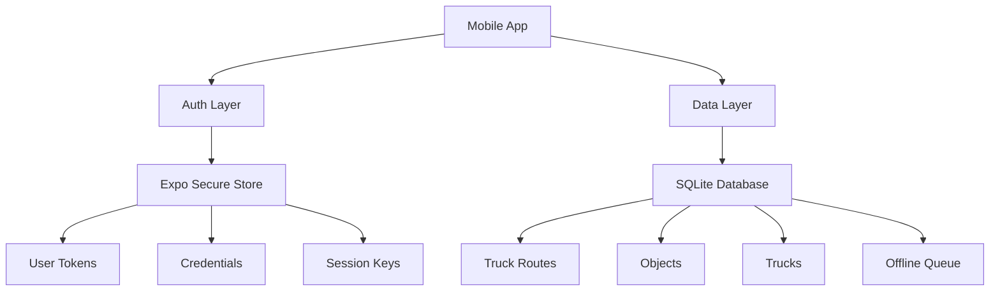
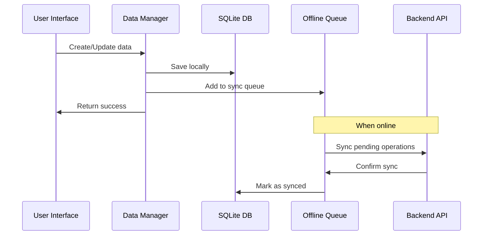

# Freight Tracking Mobile App - Arhitektūras Pārskats

## 📱 Aplikācijas apraksts

Freight Tracking ir React Native (Expo) mobilā aplikācija kravas transporta maršrutu pārvaldībai ar **offline-first** arhitektūru. Aplikācija nodrošina pilnīgu funkcionalitāti bez interneta savienojuma un automātiski sinhronizē datus, kad savienojums atjaunojas.

---

## 🏗️ Arhitektūras pārskats

### **Galvenās tehnoloģijas:**
- **React Native** ar Expo framework
- **TypeScript** - type safety
- **SQLite** - lokālā datu bāze
- **Expo Secure Store** - sensitīvu datu glabāšana
- **Offline-first** arhitektūra

### **Paralēla Storage arhitektūra:**


---

## 🗄️ Datu arhitektūra

### **Storage sadalījums:**

#### **🔐 Expo Secure Store (Autentifikācija)**
- User authentication tokens
- Login credentials
- Session identifiers
- Biometric data

#### **🗃️ SQLite Database (Aplikācijas dati)**
- Truck routes un maršruti
- Objects (iekraušanas/izkraušanas vietas)
- Trucks saraksts
- Form data un cache
- Offline operāciju queue

### **Database schema:**
```sql
-- Trucks tabula
CREATE TABLE trucks (
  id INTEGER PRIMARY KEY,
  name TEXT NOT NULL,
  license_plate TEXT,
  created_at DATETIME DEFAULT CURRENT_TIMESTAMP
);

-- Objects tabula
CREATE TABLE objects (
  id INTEGER PRIMARY KEY,
  name TEXT NOT NULL,
  address TEXT,
  created_at DATETIME DEFAULT CURRENT_TIMESTAMP
);

-- Active routes tabula
CREATE TABLE active_routes (
  id INTEGER PRIMARY KEY,
  truck_id INTEGER,
  start_date DATE,
  end_date DATE,
  status TEXT DEFAULT 'active'
);

-- Offline queue tabula
CREATE TABLE offline_queue (
  id INTEGER PRIMARY KEY AUTOINCREMENT,
  type TEXT NOT NULL,
  table_name TEXT,
  endpoint TEXT NOT NULL,
  data TEXT NOT NULL,
  timestamp INTEGER NOT NULL,
  synced INTEGER DEFAULT 0
);
```

---

## 🔄 Offline-First datu plūsma



---

## 📁 Failu struktūra

### **Core Infrastructure:**
```
utils/
├── database.ts                    # SQLite database setup
├── databaseExtended.ts           # Extended schema & operations
├── offlineDataManager.ts         # Legacy route pages (deprecated)
├── offlineDataManagerExtended.ts # Main offline CRUD operations
├── dropdownDataManager.ts        # Smart dropdown data routing
├── offlineQueue.ts               # Sync queue management
├── offlineAuth.ts                # Secure Store auth operations
└── sessionUtils.ts               # Session management
```

### **React Components:**
```
components/
├── ImprovedFormDropdownOffline.tsx           # Offline dropdown
├── ImprovedFormDropdownWithAddButtonOffline.tsx # Dropdown with add
├── AddTruckObjectScreenOfflineSimple.tsx     # Object creation
├── TruckRoute/
│   ├── index.tsx                              # Main truck route screen
│   ├── RouteBasicTabOffline.tsx              # Offline basic tab
│   ├── RouteOdometerTab.tsx                  # Odometer tab
│   └── RouteFuelTab.tsx                      # Fuel tab
└── OfflineIndicator.tsx                      # Network status indicator
```

### **Hooks & Context:**
```
hooks/
├── useTruckRouteForm.ts          # Legacy form hook (deprecated)
├── useTruckRouteFormMigrated.ts  # Offline-first form hook
└── useObjectStore.ts             # Object state management

context/
├── AuthContext.tsx               # Authentication context
└── OfflineContext.tsx            # Offline state context
```

---

## 🚀 Galvenās funkcijas

### **✅ Truck Route Management**
- **Offline truck selection** - no lokālās DB
- **Offline object selection** - iekraušanas/izkraušanas vietas
- **Route creation/completion** - ar offline queue
- **Form validation** - lokāla validācija

### **✅ Object Management**
- **Object creation** - offline ar auto-sync
- **Object listing** - no lokālās DB
- **Smart duplicate detection**
- **Store integration** - state management

### **✅ Offline Capabilities**
- **Complete offline functionality** - darbojas bez interneta
- **Automatic sync** - kad atgriežas savienojums
- **Conflict resolution** - smart merge strategies
- **Queue management** - reliable operation ordering

### **✅ User Experience**
- **Offline indicators** - skaidrs status
- **Loading states** - user feedback
- **Error handling** - graceful degradation
- **Seamless transitions** - smooth online/offline

---

## 🔧 Smart Endpoint Routing

### **Dropdown Data Manager:**
```typescript
// Smart routing based on endpoint
/trucks → getTrucks() (offline DB)
/objects → getObjects() (offline DB)
/cargo-types → Static data (no API needed)
/unit-types → Static data (no API needed)
Other endpoints → Hybrid online/offline with cache
```

### **Kodu piemērs:**
```typescript
import { getDropdownData } from '@/utils/dropdownDataManager';

// Automātiski izvēlas offline vai online
const trucks = await getDropdownData('/trucks');
const objects = await getDropdownData('/objects');
```

---

## 🧪 Testēšanas stratēģija

### **Unit Tests:**
- Database operations
- Offline queue functionality
- Data manager functions
- Component rendering

### **Integration Tests:**
- Auth + SQLite independence
- Offline/online transitions
- Data synchronization
- Storage layer interactions

### **E2E Tests:**
- Complete offline workflows
- Sync after reconnection
- Error scenarios
- Performance under load

---

## 📊 Performance optimizācijas

### **Database:**
- Indexes uz visām tabulām
- Efficient JOIN queries
- Batch operations
- Connection pooling

### **Network:**
- Offline-first strategy
- Smart caching
- Background sync
- Minimal API calls

### **UI/UX:**
- Instant local responses
- Progressive loading
- Optimistic updates
- Clear status indicators

---

## 🔒 Security

### **Data Protection:**
- Sensitive data → Expo Secure Store (encrypted)
- App data → SQLite (local only)
- No sensitive data in logs
- Secure token management

### **Authentication:**
- JWT token management
- Automatic token refresh
- Secure session handling
- Biometric support

---

## 🚀 Deployment & Build

### **Development:**
```bash
npm run start          # Start Expo dev server
npm run android        # Run on Android
npm run ios           # Run on iOS
npm run web           # Run on web
```

### **Production:**
```bash
npm run build         # Build for production
eas build --platform all  # Build with EAS
```

---

## 📚 Dokumentācija

### **Galvenā dokumentācija:**
- `docs/STORAGE_GUIDELINES.md` - Storage stratēģija
- `docs/OFFLINE_FIRST_ARCHITECTURE.md` - Offline arhitektūra
- `docs/API_MIGRATION_FINAL.md` - API migrācijas statuss
- `docs/PERSISTENT_OFFLINE_SESSIONS.md` - Session management

### **README faili:**
- `README.md` - Galvenais projekta apraksts
- `README_OFFLINE.md` - Offline funkcionalitātes apraksts
- `README-EXPO.md` - Expo specifiskā informācija

---

## 🔄 Migrācijas statuss

### **✅ Pabeigts (100%):**
- Core offline infrastructure
- Database schema extensions
- Component migrations
- Smart data routing
- Object creation offline
- Storage guidelines
- Documentation updates

### **🎯 Rezultāts:**
**Pilnīgi funkcionējoša offline-first TruckRoute sistēma!**

---

## 🛠️ Uzturēšana un attīstība

### **Koda kvalitāte:**
- TypeScript strict mode
- ESLint + Prettier
- Consistent naming conventions
- Comprehensive error handling

### **Monitoring:**
- Console logging
- Error tracking
- Performance metrics
- User analytics

### **Paplašināšana:**
- Modulāra arhitektūra
- Clear separation of concerns
- Documented APIs
- Extensible patterns

---

## 👥 Komandas vadlīnijas

### **Storage izvēle:**
1. **Sensitīvi dati?** → Expo Secure Store
2. **Aplikācijas dati?** → SQLite
3. **Dokumentē izvēli** komentāros
4. **Testē offline scenārijus**

### **Koda standardi:**
- Izmanto TypeScript interfaces
- Dokumentē funkciju mērķi
- Error handling visos async calls
- Consistent file naming

### **Git workflow:**
- Feature branches
- Code review process
- Automated testing
- Documentation updates

---

**Autors:** Freight Tracking Team  
**Versija:** 2.0 (Offline-First)  
**Pēdējā atjaunošana:** 2025-02-06  
**Statuss:** Production Ready 🚀

---

## 🎉 Sasniegumi

✅ **100% offline functionality**  
✅ **Dual storage architecture**  
✅ **Smart data routing**  
✅ **Comprehensive documentation**  
✅ **Production ready**  

**Aplikācija ir gatava ražošanai ar pilnīgu offline atbalstu!**
